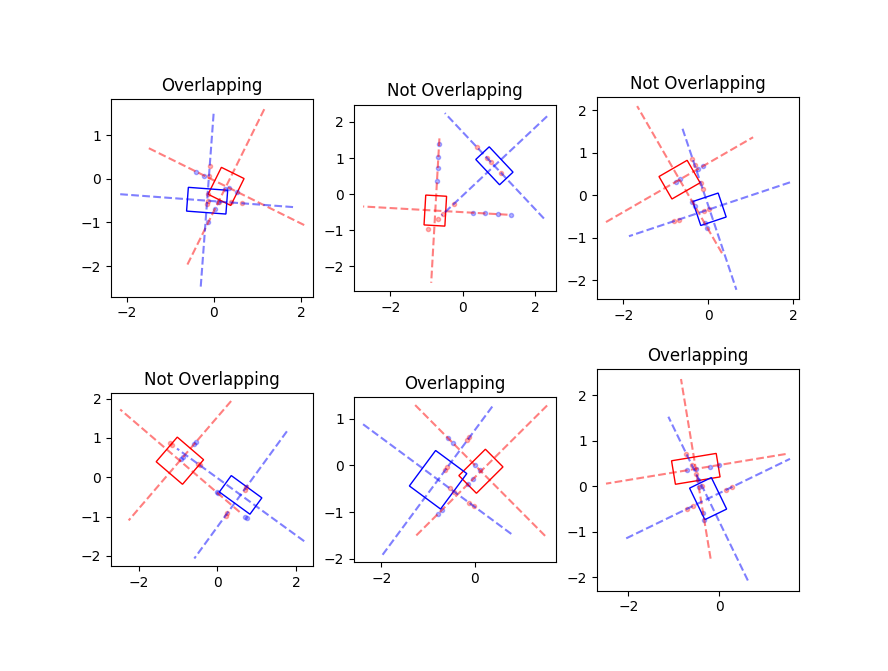

# RectOverlap
Detect whether 2 rotated rectangles overlap in python/numpy

(ported from javascript:

  [https://github.com/ArthurGerbelot/rect-collide](https://github.com/ArthurGerbelot/rect-collide)

  [https://stackoverflow.com/a/62028170](https://stackoverflow.com/a/62028170)
  
)
